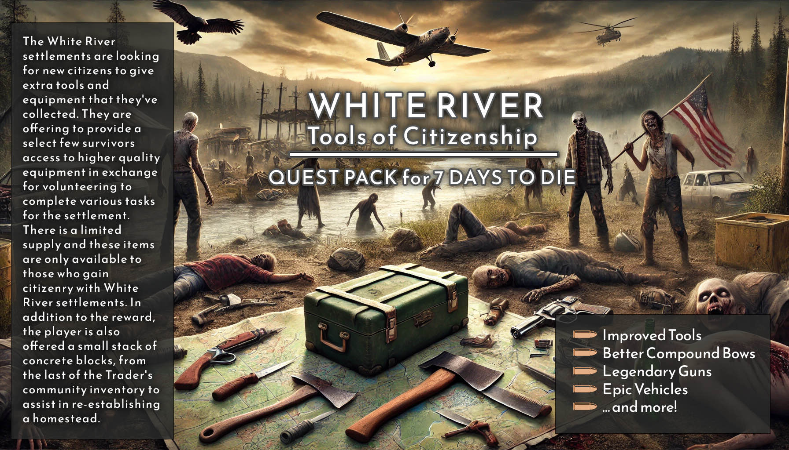

# 7DTD-WhiteRiver_ToC

## 7 Days to Die : White River - Tools of Citizenship

<https://community.7daystodie.com/topic/12269-white-river-tools-of-citizenship-quests-10-multiple-languages/>

Tested with 1.0

The White River settlements are looking for new citizens to give extra tools and equipment that they've collected. They are offering to provide a select few survivors access to higher quality equipment in exchange for volunteering to complete various tasks for the settlement. There is a limited supply and these items are only available to those who gain citizenry with White River settlements. In addition to the reward, the player is also offered a small stack of concrete blocks, from the last of the Trader's community inventory to assist in re-establishing a homestead.

--

This modlet collection extends the new player White River citizenship quest line to provide some quests to obtain improved tools, weapons, and armor. Each item has a small back-story and explanation in an attempt to blend with the vanilla game and Trader. This gives players a chance to obtain better equipment through a method other than randomness or traditional progression. The rewards this modlet pack provides were carefully considered against Vanilla gameplay. In most cases, the named items only provide a small improvement over the items they were created from. The duke and experience rewards are in-line with vanilla quests, and across all quests and tiers in this modlet pack only a handful of skillpoints are offered and only on the highest complexity quests. Due to the multi-tier design of this modlet collection, it provides equipment for beginners all the way up through the elite.

**This modlet pack is XML XPath ONLY and only needs to be installed on the server or player hosting the game! Other players do not need to install this modlet pack locally.**

The modlet collection provides multi-tier quest lines. Once the new player reaches the trader, they are given a +Declaration of Citizenship item. This allows them to start working through proving their worth as a possible citizen, through performing quests for White River. This earns the player a +White River Citizenship Card which opens up another tier of quests to complete. The player's citizenship card is returned to them after they complete the settlement's quest. If it is lost for any reason, the player may start again through another Declaration of Citizenship.

### Citizenship is offered in four-tiers:

- Tier 1 : Declaration of Citizenship - These quests are to prove your worth as a citizen. Reward: +White River Citizenship Card
- Tier 2 : White River Citizen - These are the standard/normal tier quests. Reward: +White River Veteran Citizen Card
- Tier 3 : White River Veteran - These are the veteran tier quests. Reward: +White River Elite Citizen Card
- Tier 4 : White River Elite - These are the elite tier quests.

The player uses their citizenship card (or declaration card) to craft quest-starter items for the equipment quests below. Some of the quests below offer progressive tier such as veteran version which rewards better quality, more items, and greater quantity of each multi-quantity item. Some offer an even higher level set of rewards for elite citizens.

### Challenges Support

With v1.0 also comes native support for the game's challenges page to track your progress through your White River citizenry. With this, we have changed the way that you progress through the citizenship tiers. Instead of tying the citizenship tiers merely to killing zombies, we have now tied the progression to this achievements page and configured it so that you must complete each tier of quests in order to progress to the next tier. This closes a previous loop and provides for a slightly slower progress, at the expense of players now will no longer be able to just complete whatever quests they want and ignore others.

### Questable Equipment:

**VEHICLES**
- **Amelia's Gyrocopter** - Discover the truth of what happened to Amelia Earhart. Fight a Wendigo to reclaim her long-lost schematics explaining how to build a three-seater souped-up Gyrocopter. Guaranteed to get you and your friends across the map with speed and ease.
- **Spirit of Vengeance** - Take on a demon Juggernaut and obtain a super-fast vehicle. A player using this vehicle is a sure-sign of their elite status. Big thanks to **Snufkin's Server-Side Zombies** & **Snufkins's Server-Side Vehicles** for a big part of the base code for the vehicle and zombie. Tested for compatibility with Snufkin's mods, so you can run both at the same time if you want!

**TOOLS:**
- **Black Bart's Flaming Dig Tools** - Uncover the long-buried stash from the most famous stagecoach robber in the western U.S., providing a steel Pickaxe & Shovel with flaming mods and better stats than Vanilla. Stamina trait sure to keep you digging and digging and digging.
- **Bunyan's FireAxe** - Help the Trader with some potable water and receive a Paul Bunyan branded FireAxe.
- **Dundee's Hunting Knife** - Take on everything with Dundee's famous Hunting Knife with slightly better stats than Vanilla.
- **Jason's Machete** - A replicate machete used by the infamous serial killer himself. (Big Thanks to **Wyldwitchykat** for this contribution)
- **Rick Danger's Auger** - Obtain two higher tier Augers, the latter of which will turn even the largest mountain to butter, but will expend a LOT of gasoline and degrade your Auger quick..
- **Taza's Axe** - The famed Taza's Axe, already awesome.

**WEAPONS:**
- **Bambi's Killer Compound Bow** - Earn the famed deer killer, "Bambi's Killer Compound Bow" or "Forest Prince Compound Bow" with slightly better stats than Vanilla.
- **Bear Grylls's Claws** -"Why fight bare fisted when you can fight bear fisted." Thanks, **SteamM0nkey** for this idea.
- **Daryl's Crossbow** - Obtain a replica copy of Daryl's Zombiekiller Crossbow.
- **Deschain's Revolver** - Collect the eight Dark Tower series books and craft nineteen doors to have one of Roland Deschain's legendary revolvers bestowed upon you. Has custom bullets that are expensive to craft, but super powerful.
- **Leon's Modded SMG** - Help Leon finish his DIY gun project, resulting in a 9mm SMG weapon with slightly better stats than Vanilla.
- **Pavlichenko's Rifle** - Locate and assemble a branded Marksman rifle from the famed marksman, Pavlichenko.

**ARMOR:**

- **Kuva's Red Armor** - Discover the secret ingredient in Kuva's Legendary Red Armor. This armor is rumored to be lightweight and stealthy, with resistances to heat & cold, and an extra mod slot per piece. The basic quest is EASY, but the Veteran quest is HARD.

**RESOURCES:**

- **Brass For Lead** - Help the community restock its Lead supply and in exchange receive some brass.
- **Elite Random** - Obtain a sealed crate from four veteran cards that gives you a single random elite quest starter. Obtain a veteran card back at the start of your elite quest. If you complete the Elite quest, you obtain an Elite citizen's card!
- **Everdeen's Arrows & Bolts** - The settlement is trying to put together a feast. Help feed everyone in exchange for named arrows & bolts slightly better than Vanilla.
- **Gupta's Bandages** - Can't craft first aid bandages? Trade Aloe Leaves & Cotton for a few First Aid Bandages. Gupta's bandages and first aid kits are rumored to be better quality than you can find elsewhere.
- **Molino Bulletproof Glass** - Exchange regular bulletproof glass blocks with the Trader and they will teach you how to create clear Molino-branded bulletproof glass.
- **Remington's Steel Ammo** - A spin off of Khaine's Steel Ammo mod that turns it into a questable achievement. Along with this, learn to craft an auto turret that takes the Remington 762 ammo.

The quests are designed to be repeatable in case of loss of equipment or to try your luck at a higher quality reward.

**UPCOMING:**
- **Dwarven Forge** - Track down a lost colony of little people, and their secret to crafting exquisite items.

#### Quest Listing by Tier

##### Declaration of Citizenship

- Initiate's Axe
- Jason's Machete
- Dundee's Knife
- Brass For Lead
- Bear Grylls's Iron Knuckles

##### White River Citizen Card

- Taza's Axe
- Everdeen's Arrows & Bolts
- Dundee's Knife
- Bear Grylls's Steel Knuckles
- Bambi's Compound Bow
- Leon's SMG
- Kuva's Armor
- Deschain's Revolver
- Bunyan's FireAxe

##### White River Veteran Citizen Card

- Taza's Axe
- Rick Danger Auger
- Leon's SMG
- Kuva's Armor
- BlackBart's Dig Tools
- Bambi's Compound Bow
- Pavlichenko's Rifle
- Molino Bulletproof Glass Blocks
- Gupta's Bandages
- Daryl's Compound Crossbow
- Amelia Earhart's Gyrocopter (Wendigo)

##### White River Elite Citizen Card

- Spirit of Vengeance (Juggernaut)
- Rick Danger Auger
- Remington's Steel Ammo
- Molino Bulletproof Glass Recipe
- Daryl's Crossbow
- Bambi's Compound Bow

##### Quests Not Requiring Citizen Card

- Callinicus's Greek Fire Arrows

#### Installation

Download the ZIP file and extract. Open the ONE folder and you will find MULTIPLE folders inside. Copy the MULTIPLE folders to your 7 Days to Die "Mods" folder. The default location for a Steam-based Windows 10 install is: C:\Program Files (x86)\Steam\steamapps\common\7 Days To Die\Data\Mods

### ACKNOWLEDGEMENTS:

- ALo, arkangel5736, JP :: For continuing to keep the torch lit and the modpack operational, for their many optimization contributions to every single modlet in the pack, and for by and large bringing the entire modpack up to 1.0 compatibility. My deepest gratitude on behalf of the community.
- Wyldwitchyka :: For the addition of the Jason's machete quest
- morggin :: For the name and lore behind BlackBart, for the Bambi Terminator Crossbow, and for the idea of an Elite level set of quests
- RichardPaul :: For the poem used in the Black Bart quest line.
- Aeyvi-Daro :: For quest text and testing assistance on all quests.
- mr.devolver :: Big thanks for the help fixing the GoTo Trader, improving the quest integration with the trader, and helping seek out a path to add the quests to the Trader dialog!
- SteamM0nkey :: Big thanks to helping dive into the cause of imbalances in items, missing stats, and for the idea of the Bear Claws quest.
- arramus & Fuzzy Pug :: Fuzzy Pug requested a new quest be added that grants clear bulletproof glass. arramus was kind enough to do the heavy lifting to create the quest, I rebranded the naming of it but mostly kept the quest and code intact as was provided.
- sechsterversuch & Zeeeni :: BIG thanks to these two for providing a full German translation for every quest, and for testing the translations afterwards!
- IBM Watson :: For providing language translation for all other languages.
